# Step-by-step guide

This guide walks through the whole routine on the **demo app**, so you can practise without touching a real system.
The screenshots were taken from the real bookmarklets (`node build/guide-shots.js` regenerates them).
Red frames with numbers show where to click.

Browser dialogs (questions and messages) are drawn in the screenshots with their real text, because a browser
cannot take a picture of its own dialogs.

## 1. Install the bookmarklets

Open the installer: <https://johnsnow46.github.io/bookmarklet-autopilot/>

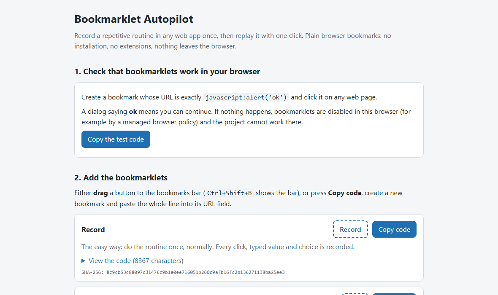

1. Show the bookmarks bar with `Ctrl+Shift+B`.
2. Check that bookmarklets work: press **Copy the test code**, create a new bookmark, paste it as the URL and click
   the bookmark. A dialog saying `ok` means you can go on.
3. For each bookmarklet you want, **drag** the dashed button (1) to the bookmarks bar. If dragging does not work, press
   **Copy code** (2), create a new bookmark and paste the whole line into its URL field.

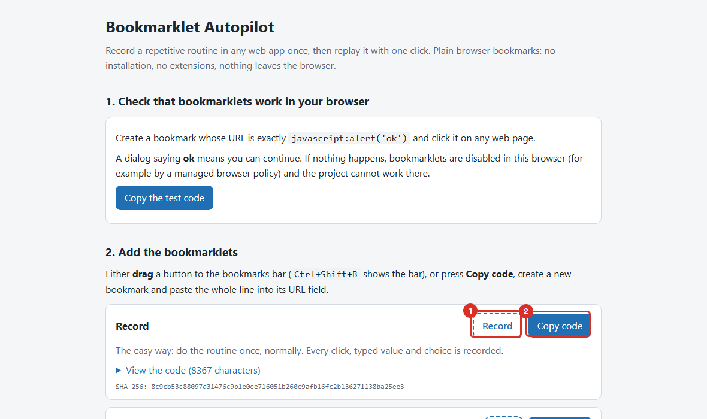

To start, you need **Record**, **Play**, **Dry run**, **Series** and **Show**.

## 2. Open the demo app

Open the [demo app](https://johnsnow46.github.io/bookmarklet-autopilot/mock/demo-app.html). It imitates a typical
routine: enter a product code, search, open the product, copy a line, fill the form, save, generate, print, apply.
The **Test panel** on the right has codes you can click instead of scanning them, and a **Log** of what the app received.

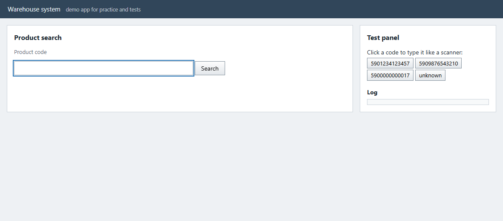

## 3. Record the routine once

Click the **Record** bookmark. A red bar appears: from now on every click, typed value and choice is recorded.
*Undo last* removes the last step, *Cancel recording* throws everything away.

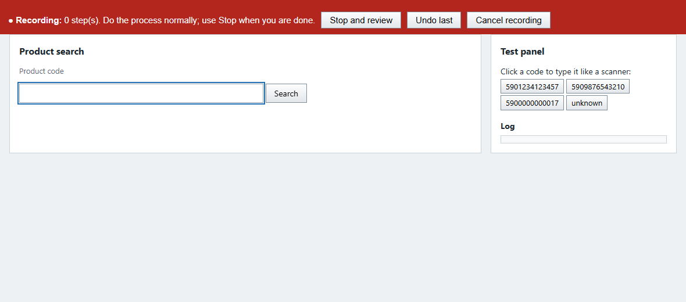

Now do the routine **normally, once**:

1. Type or scan a code into *Product code* and click **Search**.

   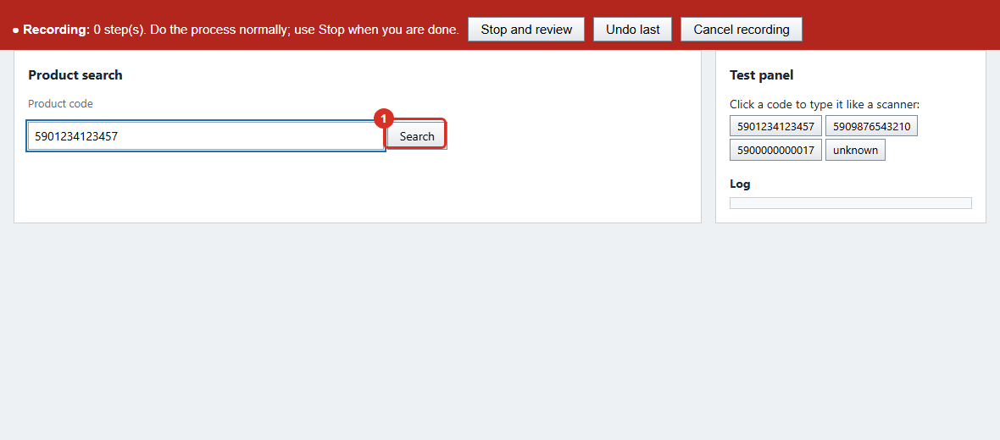

2. Click the product in the results.

   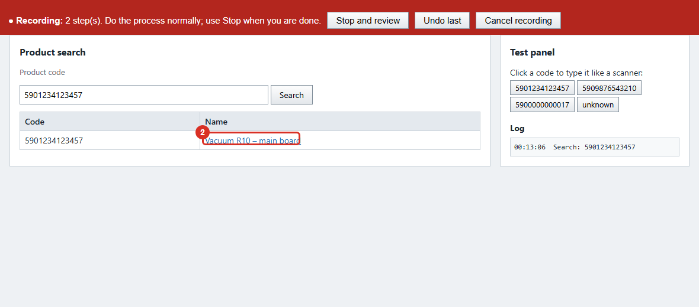

3. Fill the form: copy *Line 1* into *Line 2*, type a text into *Line 3*, choose the *User*, then click **Save**.

   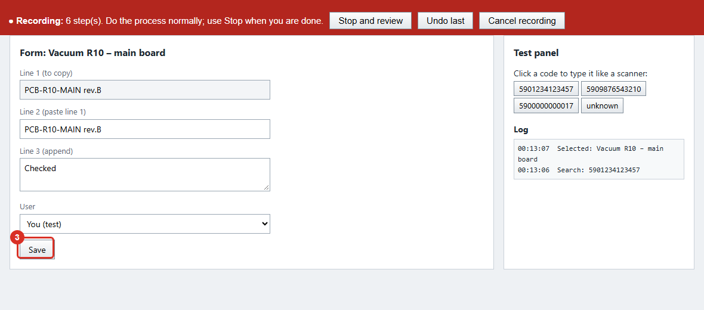

4. Click **Generate**, then **Print**. The print preview opens in a **new tab**. Recording does not jump to a new tab
   by itself, so click the **Record** bookmark again there (it asks whether to continue the recording: OK), then click
   **Apply**.

   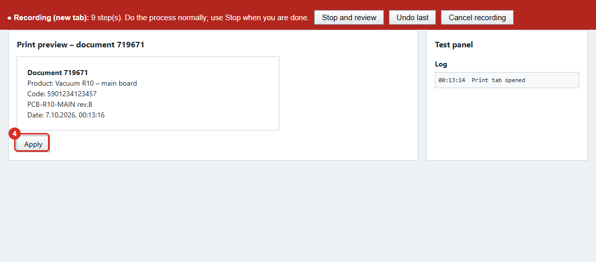

5. Click **Stop and review** on the red bar.

   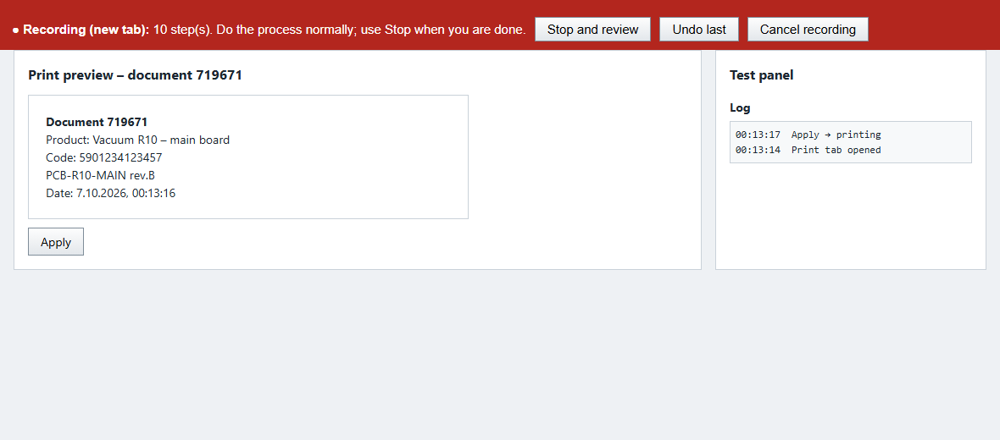

## 4. Answer the review questions

Record lists what it saw and asks a few short questions. An empty answer accepts the suggestion, which is usually right.

**Steps to remove.** If you clicked something by mistake, type its number (several: `3,5`). Otherwise leave it empty.

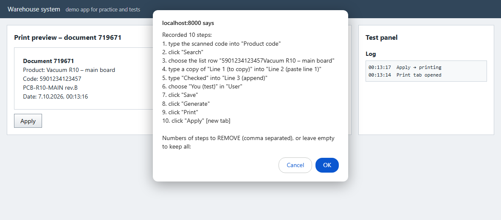

**How to pick each list value.** For every list choice Record asks what it means:

- `1` always this one (the same value every time);
- `2` the only row that is shown (it changes with every code, like the product in the results);
- `3` your name (what differs between people using the same recording);
- `4` your organization.

For the product row the suggestion is `2`:

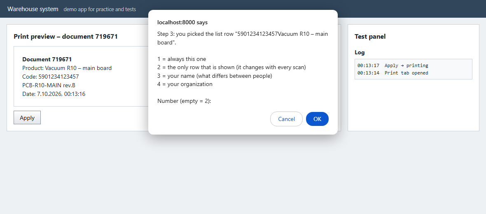

For the *User* list, `1` keeps "You (test)" every time. Choose `3` if other people will use your recording and should get
their own name selected:

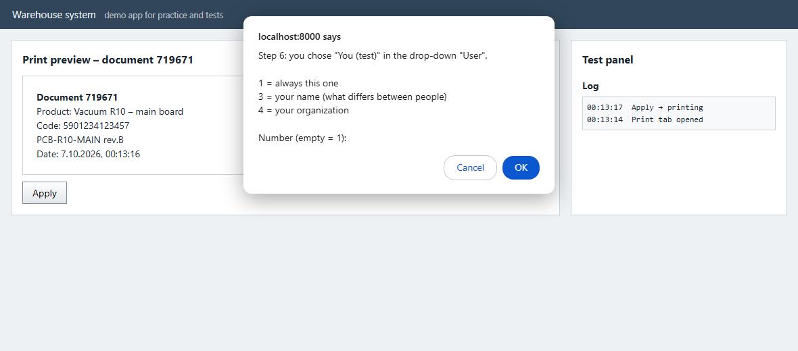

**Before which steps to ask "Save?".** The suggestion is the *Save* step: before saving, Play stops and lets you look at
the form. Keep it until you trust the recording. `0` means never ask.

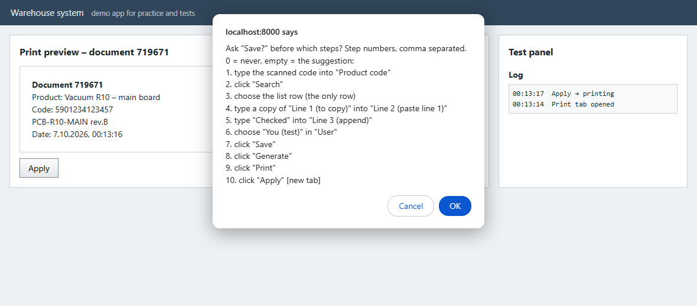

**Save this recording?** A last summary. OK saves it.

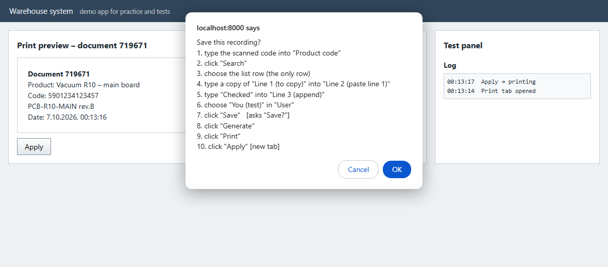

The bar turns green: the recording is saved in this browser.

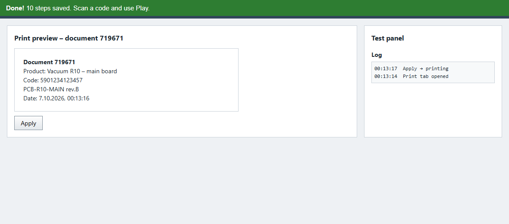

## 5. Check with Dry run

Dry run is the safe test: it **clicks and types nothing**. It looks for each recorded step on the screen as it is now
and outlines what it finds in green. Run it on the first screen of the routine:

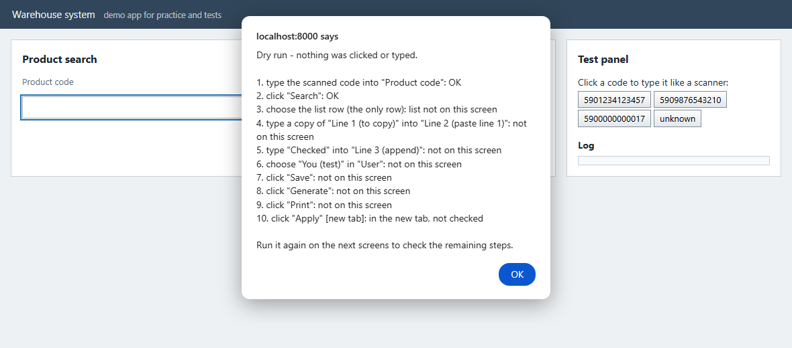

`OK` means the step was found. `not on this screen` is normal for steps of later screens: go to the next screen and run
Dry run again. If a step of the *current* screen is not `OK`, the page differs from the recording; record again.

## 6. Play

Enter the next code (type or scan it) and click the **Play** bookmark.

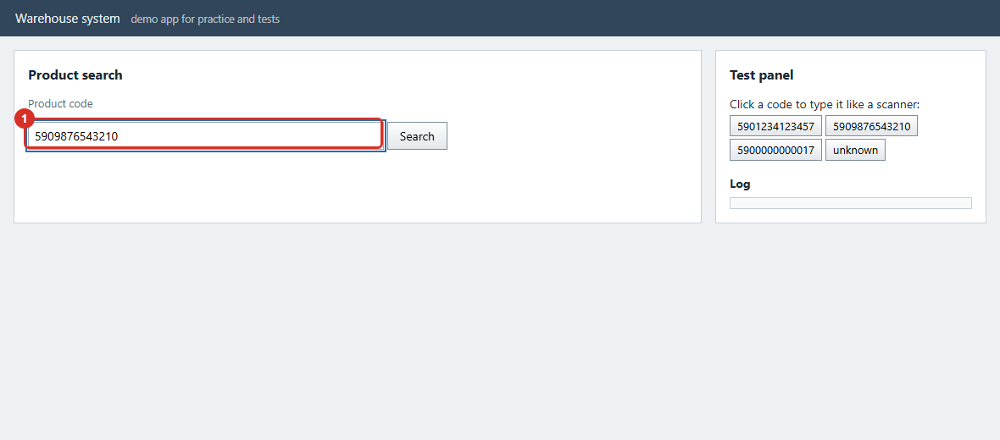

Play does every step for you, copies the values that were copied while recording, and stops before Save with the
question **Save?**. Check the form: **OK** saves and goes on, **Cancel** stops without saving.

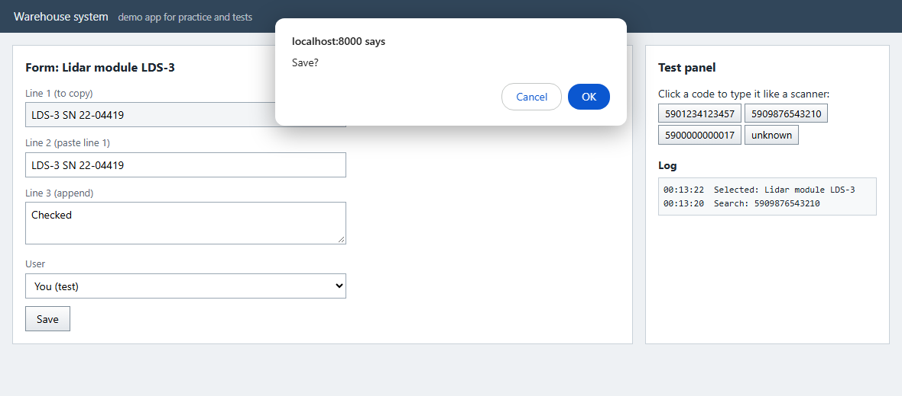

After Save it clicks Generate and Print, takes over the new tab and clicks Apply. The only thing left to you is the
system print dialog.

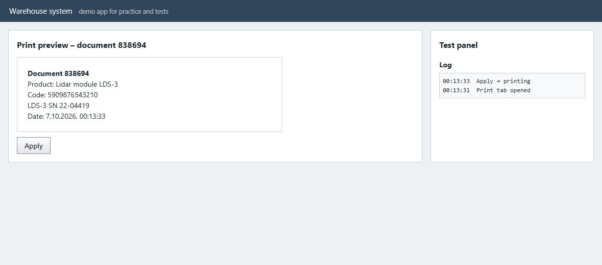

If something is different from the recording (a missing button, two matching rows, an error from the application),
Play stops and says at which step and why. Nothing is saved on a guess.

## 7. Many items: Series

Click **Series** once. A blue bar waits for a code; enter one and the whole routine runs, then it waits for the next
code. Two identical codes in a row count as two items. Press **Stop** on the bar when you are done.

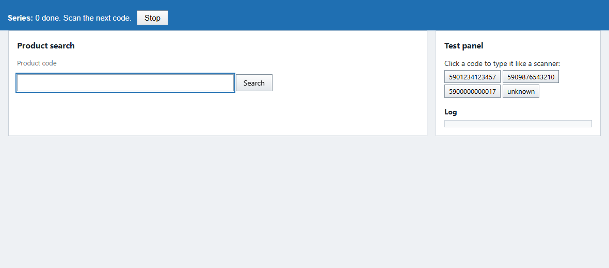

If the application reloads the whole page between steps, Series cannot survive the reload: use Play there and click
it again after each reload.

## 8. See what is stored: Show

**Show** lists the recorded steps, the "Save?" setting, profiles and validation rules.

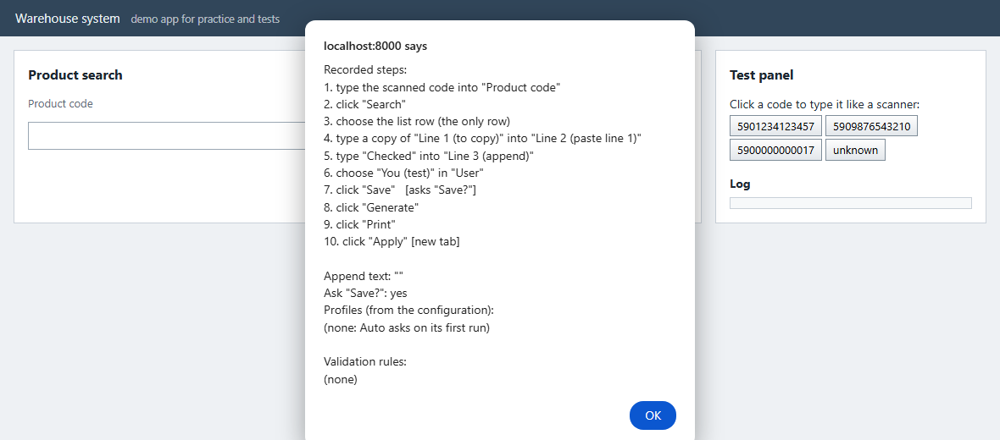

Then it shows the **run log**: how many runs today, how many completed, and the average time of a completed run.
The log never contains codes, products or names. It also offers to clear the log and to change your profiles (your name
and organization for lists where you answered `3` or `4`).

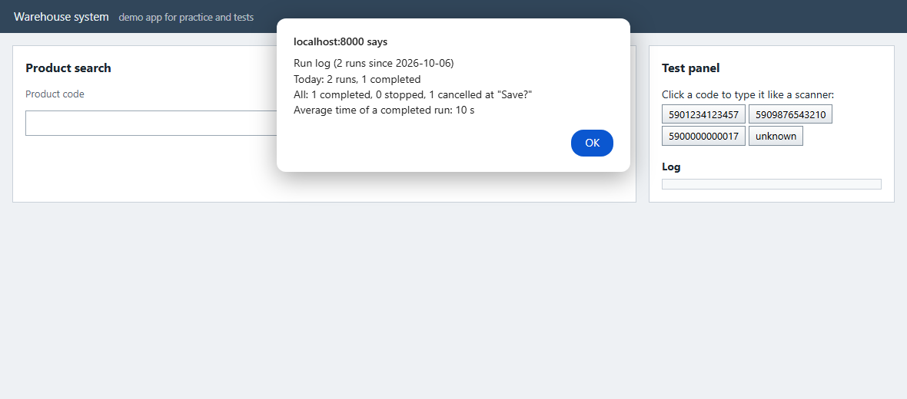

## 9. On a real site

The steps are the same:

1. Check that bookmarklets work (step 1).
2. **Record** the routine once on a real item, keeping the "Save?" question.
3. **Dry run** on each screen.
4. **Play** one item and check the form at "Save?".
5. Then Play or Series every day.

Allow pop-ups for the site if the routine opens a new tab. What you record stays in this browser; to use it on another
computer or share it, use **Export** (it lists every fixed text it will contain before copying). Read
[SECURITY.md](SECURITY.md) before using it on a site that matters.
